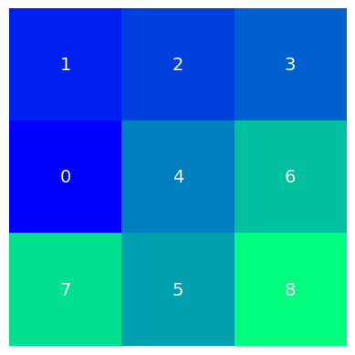
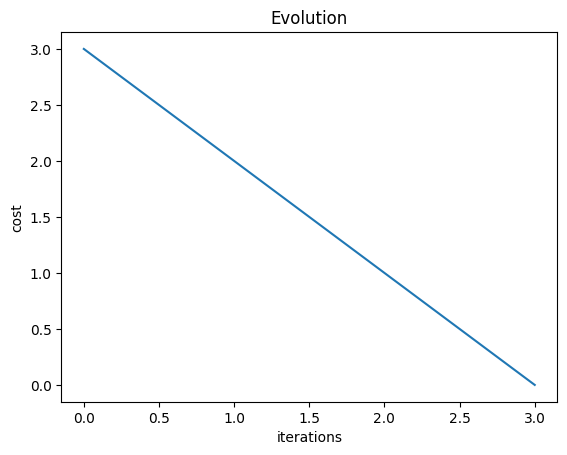
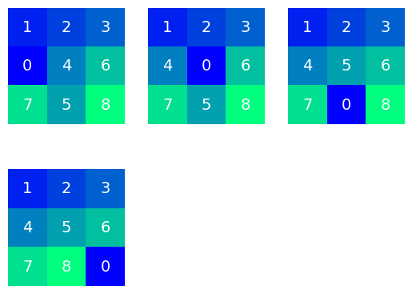

# Puzzle-8

Resolvendo o Puzzle-8 com Hill climbing estocástico.

Este repositório contem o algoritmo para resolver o puzzle-8 com hill climbing estocástico.

## Exemplo:





## Demonstração

[](https://youtu.be/mZv9SEVtDxE)

## Como executar

Para executar este algoritmo você precisa ter o [uv](https://github.com/astral-sh/uv) instalado.

com isso rode:

```bash
uv run puzzle.py
```

